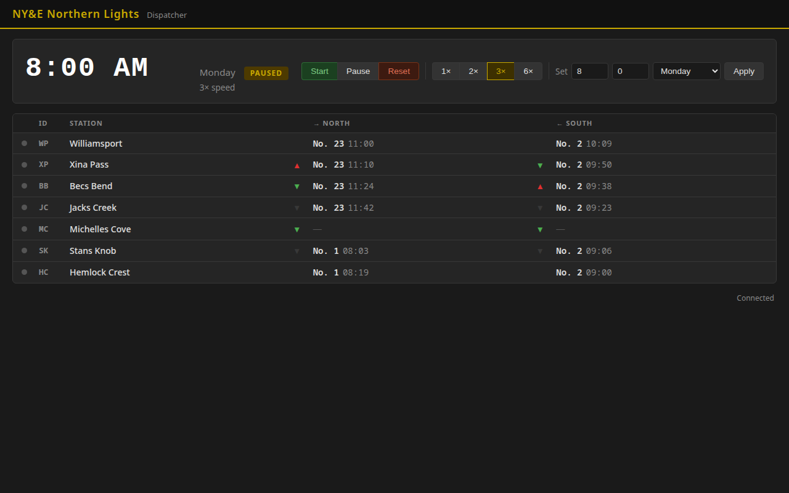

# NY&E Layout Control System — Implementation Plan

**Version:** 1.8
**Date:** 2026-05-17
**Status:** Active

---

## Phase 1 — Infrastructure

### Session 1.1 — RPi5 Base Setup ✅ COMPLETE (2026-05-13)
- WiFi AP: SSID `NYE_Layout`, `192.168.10.1/24`, ch 6, DHCP .10–.254, NM-managed, autostart
- Mosquitto 2.0.21: `192.168.10.1:1883` (restricted from 0.0.0.0 after stable WiFi AP confirmed), auth required, ACL per device class, persistence, autostart
- systemd unit stubs: `rr-clock` + `rr-dispatcher` (enabled, not started — Sessions 1.2/1.3)
- OS: Debian trixie (RPi5), hostname `rpi5-2`, eth0 192.168.86.36 (DHCP reservation set)
- Scripts: `RR_Server/scripts/` — `setup_ap.sh`, `setup_mosquitto.sh`, `install_services.sh`, `test_broker.sh`, `deploy.sh`
- Note: Mosquitto config goes in `/etc/mosquitto/mosquitto.conf` directly (not conf.d) — Mosquitto 2.0 enters local-only mode if main file has no listener
- **Completion:** RPi5 creates WiFi AP; Mosquitto accepts authenticated connections ✓

### Session 1.2 — Fast Clock Service
- `fast_clock/clock_service.py`: start/pause/set/reset/speed/set_tick_interval, sync_request response, state persisted to `clock_state.json`
- `config.json`: shared broker credentials + clock defaults (gitignored; `config.json.example` is the template)
- `requirements.txt`: `paho-mqtt>=2.0.0`
- `scripts/setup_venv.sh`: copies deployed files to `/opt/rr_server/`, creates Python venv
- systemd `rr-clock` unit (stub installed in Session 1.1, started this session)
- **Completion:** clock runs headlessly, publishes ticks on schedule, survives restart from saved state

### Session 1.2a — Timetable Loader ✅ COMPLETE (2026-05-15)
- `data/timetable.json`: 22 trains (11 NB + 11 SB), 15 NLS locations, COE stub. All transcribed from Timetable No. 4. Station names updated to remodel names.
- `common/timetable.py`: `load()`, `locations()`, `location_by_id()`, `active_trains()`, `train_schedule()`, `next_train()` with midnight-wrap support
- 23 unit tests, all passing (64 total across the project)
- **Completion:** timetable loads; next-train and location queries work per location/direction/time ✓

### Session 1.3 — Dispatcher UI: Clock + Status ✅ COMPLETE (2026-05-16)
- FastAPI skeleton + WebSocket MQTT bridge
- Clock display with pause/start/set controls
- Station table: 7 rows, online/offline dot, next scheduled train per direction, TO signal arm state
- systemd `rr-dispatcher` unit started and enabled
- **Completion:** working page at `http://192.168.86.36:5000` showing live clock, station status, next trains, and TO signal indicators



### Session 1.4 — Station_OS: Clock + Network ✅ COMPLETE (2026-05-17, hardware tested 2026-05-17)
- Provisioning: NVS serial CLI (`help`, `set <key> <value>`, `save`, `clear`) — same pattern as TO_Signal
- LittleFS schedule (`data/schedule.json`): all 7 CYD stations, 86 stop entries, 2.4 KB; generated by `scripts/gen_schedule.py`
- MQTT: LWT (`trains/station/{id}/status`), 60 s heartbeat, `sync_request` on reconnect; subscribes to `trains/clock/time` + `trains/clock/control`
- Clock screen (LVGL, 320×240): station name (yellow), large RR time (white, montserrat_48), next NB (green) + SB (cyan) per-station
- Local clock interpolation (runs between MQTT ticks using real elapsed time × speed factor)
- `huge_app` partition (3 MB app, 896 KB LittleFS); flash usage 41.6%, RAM 19.1%
- `scripts/copy_lv_conf.py`: pre-build script copies `lv_conf.h` → lvgl/ AND `User_Setup.h` → TFT_eSPI/ (both must be copied; libraries resolve their own headers first)
- Display: direct TFT_eSPI global object + custom LVGL flush callback (`lv_display_create` / `lv_display_set_flush_cb`) — avoids `lv_tft_espi_create` rotation issues
- WiFi stability: `WiFi.setAutoReconnect(false)` + guard in `connectToWifi()`/`connectToMqtt()` — prevents ASSOC_LEAVE cycling caused by spurious boot-time disconnect event
- **Completion:** unit BB hardware tested — online, clock display correct, next-train correct, MQTT stable ✓
- **Deferred items:**
  - Analog clock face (replace digital montserrat_48 with clock hands) — design TBD
  - Crew-info view for next station (relevant data for extras and late-running trains) — needs design session
  - WiFi captive portal provisioning — needs design session
  - Dispatcher web page clock interpolation (currently updates only on tick receipt; needs client-side JS interpolation matching CYD pattern: `elapsed_rr_min = (Date.now() - tickAt) / 1000 * speed / 60`)

- **CYD screen architecture — DESIGN DECIDED (2026-05-17):**
  Navigation is touch-triggered by the agent, not auto-pushed by MQTT. Flow:

  ```
  CLOCK ──[touch]──► OS SCREEN (train#, section#, direction, Submit)
                          │
                     [Submit OS]
                          │
                ┌─────────┴──────────┐
           TO stored              No TO for
           for this train         this train
                │                    │
                ▼                    │
          TO TEXT SCREEN             │
       (large text, copy to          │
        paper, ACK button)           │
                │                    │
             [ACK]                   │
                └──────────┬─────────┘
                           ▼
                  NEXT-STATION SCREEN
                (timetable entry for the
                 train's next station —
                 always shown after OS)
                           │
                   [touch or timeout]
                           ▼
                         CLOCK
  ```

  Key design decisions:
  - **TO is received and stored on the CYD via MQTT** when Dispatcher issues it. The raised TO Signal arm (hardware) is the crew's cue — no screen push needed.
  - **OS screen has a timeout** (~15 s) — auto-returns to clock on inactivity (prevents stuck screen from accidental touch).
  - **Multiple TOs for same train** — deferred; for now show first matching TO. Future: "next order" button.
  - **ACK is per-station** — Dispatcher must track which stations have ACK'd (a TO addressed to multiple trains/stations only lowers the signal once all named stations ACK).
  - **Next-station screen is always shown** after OS (with or without a TO) — gives the agent the timetable entry for the train's next stop before returning to clock. Needs timetable data already in LittleFS (schedule.json has the data; lookup logic TBD in Session 2.1).
  - **Clearance flow** (Session 2.3) — same touch-triggered pattern; clearance screen activates from OS screen or directly from clock if a clearance is pending for this station.

- **CYD I2C / peripheral design question — discuss next session before any 2.x implementation:**
  The CYD (ESP32-2432S028R) has **three external connectors** (CN1 I2C, CN2, CN3 — exact pin assignments to confirm against physical board) and one USB port. I2C is a bus — one connector port can chain multiple devices (PCA9685 + ESP32 slave + sensors on the same two wires). Candidate uses and questions to resolve:

  **I2C bus candidates:**
  - **PCA9685** (16-ch PWM): station lighting (platform lamps, building interiors, signals) and/or TO signal arm servos. Note: servos need ~50 Hz; LEDs tolerate higher frequencies — may need separate PCA9685 chips for each, or accept 50 Hz for LEDs (dim but workable).
  - **TO_Signal ESP32 as I2C slave**: instead of WiFi/MQTT, the CYD commands the TO Signal box directly over a short I2C wire. Reduces RF dependency for a local connection but adds a physical cable between CYD and signal mast.
  - **Other I2C devices**: environmental sensors, RTC backup, I/O expanders — TBD.

  **Physical constraint — only 3 external connectors:**
  - Everything external to the CYD must share these ports (I2C bus, power, any UART/GPIO needs).
  - I2C bus chaining partially solves this — multiple devices per port — but connector type and power budget must be checked.
  - Connector pinout (especially whether CN1 conflicts with TFT backlight on GPIO 21) must be verified against the physical board before committing to any wiring plan.

  **Architecture impact:**
  - If CYD + PCA9685 absorbs TO signal servo control, the TO_Signal ESP32 boxes may not be needed per station (significant BOM reduction).
  - If TO_Signal ESP32 stays but moves to I2C slave mode, its WiFi/MQTT stack is no longer needed — simplifies that firmware considerably.
  - Decision affects Session 2.1 scope and all subsequent CYD hardware design.

### Session 1.6 — Provisioning Script _(planning session required first)_
- A `provision/` directory containing a single `provision.sh` entry point and a `layout_config.sh` variable file
- Covers: OS packages, code deploy to `/opt/rr_server/`, venv, AP config, Mosquitto config, systemd units, health check
- Idempotent — re-run to repair same Pi or clone to a fresh Pi from USB
- **Deferred until after Session 1.5** so the full system is known before the script is written
- **Completion:** plugging USB and running one script fully rebuilds the layout server from scratch

### Session 1.5 — JMRI on RPi5
- Fresh JMRI install on RPi5; PR3 LocoNet USB config (DCS51 physical connection not required)
- JMRI MQTT bridge pointed at layout broker (`trains/turnout/...`)
- systemd `jmri` unit; verify WiThrottle server starts
- **Completion:** JMRI running at `192.168.10.1:8080`; WiThrottle accessible; Switch_Control unchanged

---

## Phase 2 — Operations

### Session 2.0 — WP Yardmaster Page
Scoping complete (2026-05-02). **Hardware needed before this session:** RPi3 + HDMI touchscreen display (ELECROW 7" IPS 1024×600 pk=106 or 5" TN 800×480 pk=107 — in stock, size TBD).

- FastAPI `/yard` route — optimized for RPi3 7" touchscreen in Chromium kiosk mode
- NLS arrival notifications from Dispatcher (via `trains/yard/notification`)
- NLS departure lineup (from timetable + dispatcher adjustments)
- C&O schedule display (read-only reference — interchange and main-clear planning)
- Consist report form: train #, engine #, caboose #, loaded cars, empty cars (editable before submit)
- Ready flag combined with consist submission — formal signal to Dispatcher
- MQTT: publishes `trains/yard/consist`; subscribes to `trains/yard/notification`
- **Completion:** Yardmaster can view lineup, receive Dispatcher notifications, submit consist + ready

### Session 2.1 — OS Submission
- Station_OS: OS screen (train number + section number keypad, direction toggle, submit)
- Dispatcher UI: scrolling OS log (station, train, section, direction, RR time)
- **Completion:** station agent submits OS with section number; Dispatcher sees it logged

### Session 2.2 — Train Orders
_Requires TO type definitions planning session before implementation — TO types, field schemas, and text templates must be defined first._
- Dispatcher UI: structured TO form (type selector + required fields), multi-station selector, Issue button; TO signal arm auto-raises on issue
- Station_OS: Orders screen (TO text display, N/S signal arm status, ACK button)
- Full ACK flow back to Dispatcher UI
- **Completion:** Dispatcher issues TOs; stations receive, display, and ACK

### Session 2.3 — Clearance Forms
- Dispatcher UI: clearance issuance (train, direction, text, destination station)
- Station_OS: Clearance screen (activates on receipt, ACK button)
- **Completion:** clearances issue and ACK at any station

### Session 2.4 — TO Signal Firmware ✅ COMPLETE (2026-05-13)
- `TO_Signal/src/main.cpp`: 2 servos (N=GPIO 13, S=GPIO 14), smooth sweep + mechanical bounce, serial CLI calibration, rr_time tracking, NVS config
- Per-unit servo angles stored independently in NVS (N raised/lowered, S raised/lowered) — calibrated via serial CLI on each unit
- LWT/heartbeat deferred to later phase (not needed for MVP operation)
- **Test broker:** layout RPi5 — requires Session 1.1 before bench testing
- **Completion criteria (pending):** Dispatcher raises/lowers signal arms from web UI; arms respond and report state — integration test after Sessions 1.1–1.3

### Future — Bad Order Reporting (Yardmaster Page)
_Scope defined; session number TBD. Design details required before implementation._
- Yardmaster page: flag a car or locomotive as bad order (road name + number, defect description)
- Bad order equipment blocked from consist assignment until owner releases it via CC&W Manager
- Owner release flow: review defect, mark repaired, restore to active roster
- **Completion:** Yardmaster can report defects digitally; bad order equipment is locked out of service automatically

---

## Management Tools (owner-facing, schedule TBD)

These tools are needed before the first operating session. Initial sessions may use hand-edited JSON files where noted. **A dedicated planning session is required before any management tool implementation begins** — see Next Planning Session below.

### TO Type Definitions _(prerequisite for dispatcher UI design)_
- Define all TO types used on the NY&E (meet, wait, running extra, work extra, speed restriction, etc.)
- For each type: required fields, formatted text template, addressed-station rules
- Output: TO type registry used by the dispatcher UI structured form and by the management tools

### C&O Timetable Data _(content task — no planning session required)_
- Source: `NYELayoutDocs/alt/timetable.ods` Sheet2 — C&O East Central Subdivision schedule
- Westward trains: 21, 93, 91, 4104, 7, 5, 23 (with Williamsport times)
- Eastward trains: 12, 6, 32, 593, 4103, 92, 94, 4165 (with Williamsport times)
- Populate COE `"trains": []` stub in `data/timetable.json`
- Minimum fields: number, direction, days, Williamsport arrive/depart; add staging times if present
- **Completion:** C&O trains appear in Yardmaster page C&O reference display (Session 2.0)

### Timetable Management Tool
- Create, edit, and version timetables (version number + release date)
- Input: `Stringline.ods` segment profile data (track distance from XTrkCAD, class speeds, stop delays) — **XTrkCAD dependency**
- Generate `timetable.json` including `segments` section (inter-station travel times per class)
- Generate printed timetable in Timetable No. 4 format
- Generate String Table (train scheduling diagram showing meets and crossing points)
- Generate per-station condensed schedule cards (previous station / current station / next station)
- Generate "X" column extra-train travel times for printed timetable
- _Initial sessions: seed JSON hand-edited from timetable.pdf; segments populated once XTrkCAD data is available_

### CC&W Manager (Car Cards & Waybills)
- Car database: car ID, type, road name, description, **bad order status, defect log, inspection history**
- Industry database: name, station, commodities accepted/shipped, track capacity
- Waybill database: routing assignments per car (owner sets between sessions)
- Printed outputs: car cards (permanent, print once per car), waybills (print each session cycle)
- Bad order equipment is excluded from consist assignment until owner releases it

### Trainmaster Function
- Pre-session tool (owner role): reviews active waybills, matches to scheduled trains, identifies extras needed
- Input: CC&W waybill data, active timetable, yard track data
- Output: `session.json` — train manifests (car-by-car per train), pre-authorized extras and work extras, annulments, active waybill references
- Dispatcher (pre-session) reviews and approves extras before session start
- `session.json` is loaded onto RPi5 by owner at pre-session setup; server reads it at session start

### session.json Format _(design required)_
Generated by Trainmaster function. Contains:
- Session header: date, timetable version, session number
- Train manifests: per-train car list (road name, car type, car ID, destination)
- Pre-authorized extras: engine, type (running/work), direction, stations, planned departure
- Annulments: trains not running this session + reason
- Active waybill references

### yard.json Format _(design required)_
Yardmaster-only data. Separate from `timetable.json`. Contains:
- Yard track numbers and designated functions (caboose, interchange, departure, arrival, local, etc.)
- Track numbers not yet assigned — pending physical layout construction

### Post-Session Report
- Generated by owner page after session ends
- Content: OS log, TOs issued, consists, extras run, annulments, session duration (real + RR time)
- Saved as file for owner's records; future use: Trainmaster comparison of plan vs. actual

---

## CAD — Parallel Track

| Item | Qty | When |
|------|-----|------|
| CYD fascia enclosure | 7 | Deferred — after implementation and testing complete |
| TO Signal ESP32 enclosure | 5 | Alongside Session 2.4 |
| Yardmaster terminal mount | 1 | RPi3 + 7" screen enclosure; before Session 2.0 |
| RPi5 / PR3 server mount | 1 | Any time after Session 1.1 |

---

## Phases 3–6

| Phase | Scope | Trigger |
|-------|-------|---------|
| 3 — Cameras | ESP32-CAM firmware + Dispatcher Display 2 grid | Phase 2 fully in use |
| 4 — RFID | Station approach readers + auto-OS suggestion | After cameras |
| 5 — Lighting | Day/night cycle via fast clock | Scenery far enough along |
| 6 — Dispatcher Assist | Newbie mode, conflict detection | After multiple operating sessions |

---

## Hardware to Order

| Item | Purpose | Needed by |
|------|---------|-----------|
| ~~RPi 7" Official Touchscreen (DSI)~~ | ~~Yardmaster terminal display~~ | **In stock:** ELECROW 7" IPS 1024×600 (pk=106) or 5" TN 800×480 (pk=107) — HDMI, size TBD before Session 2.0 |

---

---

## Next Planning Session — Management Tools + System Diagram

**Goal:** Complete planning for management tools before any implementation begins.

### Agenda

1. **TO type definitions** — define all NY&E TO types and field schemas (prerequisite for dispatcher UI)
2. **Timetable Management Tool design** — inputs, outputs, UI approach (desktop tool or web?)
3. **CC&W Manager design** — car/industry/waybill schema, printed output formats
4. **Trainmaster function design** — session planning workflow, session.json schema
5. **yard.json schema** — track numbers, functions, capacity
6. **Post-session report design** — content and format
7. **Visual system diagram** — research current practice for software architecture diagrams (Mermaid, C4 model, PlantUML, draw.io); select format and produce a diagram of the full system (components, connections, data flows). Candidate formats:
   - **Mermaid** — text-based, renders in GitHub, good for component/sequence diagrams
   - **C4 model** — structured hierarchy (Context → Container → Component); good for communicating architecture at different levels
   - **PlantUML** — text-based, richer diagram types, requires render server

### Deferred from this session (also agenda items)
- **RR_Server design doc** — write the full design document now that decisions are confirmed
- **Dispatcher web app detailed design** — UI state, interaction flows, API spec (requires TO types first)
- **Station_OS firmware design** — state machine, screen transitions, provisioning workflow

---

## Revision History

| Version | Date | Change |
|---------|------|--------|
| 1.0 | 2026-05-02 | Initial plan established |
| 1.1 | 2026-05-02 | Session 1.2a (timetable loader) added; Session 2.0 scoping complete; yardmaster terminal hardware noted; Management Tools added; CC&W defined |
| 1.2 | 2026-05-05 | Management Tools expanded: TO type definitions (prerequisite), Trainmaster function, session.json, yard.json, post-session report. Next Planning Session agenda added. Visual system diagram identified as a planning task. |
| 1.3 | 2026-05-13 | Session 2.4 (TO Signal firmware) complete — out-of-order implementation; firmware done, integration pending Sessions 1.1–1.3. Session 1.1 complete — RPi5 AP + Mosquitto running. |
| 1.4 | 2026-05-13 | Session 1.2 implemented: clock_service.py, config.json (shared credentials), requirements.txt, setup_venv.sh. Session 1.6 (provisioning script) added — deferred until after Session 1.5. |
| 1.5 | 2026-05-15 | Session 1.2a complete: timetable.json (22 NLS trains, COE stub), common/timetable.py, 23 tests. |
| 1.6 | 2026-05-15 | Pre-1.3 cleanup: location_by_id() added to timetable.py; hardware table updated (ELECROW displays in stock); Session 2.0 hardware note updated; Session 2.2 TO-type prerequisite noted; C&O timetable data task added; Session 2.2 description updated to structured TOs. |
| 1.7 | 2026-05-17 | Session 1.4 complete: Station_OS full rewrite — NVS provisioning, LittleFS timetable, LVGL clock screen, MQTT heartbeat/sync. |
| 1.8 | 2026-05-17 | Session 1.4 hardware tested (unit BB). Build lessons (User_Setup.h copy, direct flush callback, WiFi guard). Deferred items + CYD screen architecture question documented. Dispatcher clock interpolation noted. |
