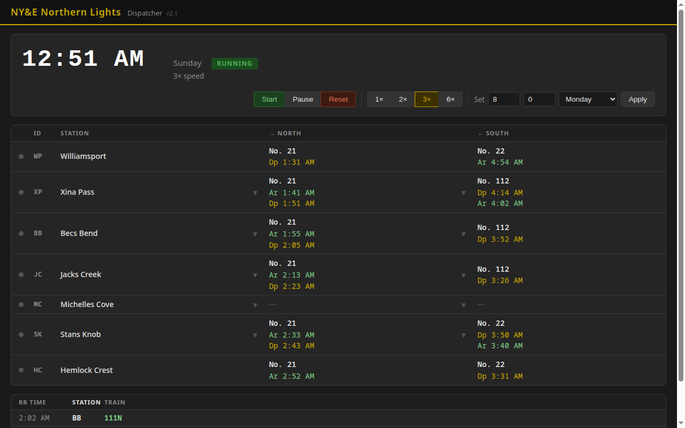

# NY&E Layout Control System — Implementation Plan

**Version:** 2.3
**Date:** 2026-05-23
**Status:** Active

---

## Phase 1 — Infrastructure

### Session 1.1 — RPi5 Base Setup ✅ COMPLETE (2026-05-13)
- WiFi AP: SSID `NYE_Layout`, `192.168.10.1/24`, ch 6, DHCP .10–.254, NM-managed, autostart
- Mosquitto 2.0.21: `192.168.10.1:1883` (restricted from 0.0.0.0 after stable WiFi AP confirmed), auth required, ACL per device class, persistence, autostart
- systemd unit stubs: `rr-clock` + `rr-dispatcher` (enabled, not started — Sessions 1.2/1.3)
- OS: Debian trixie (RPi5), hostname `rpi5-2`, eth0 192.168.86.36 (DHCP reservation set)
- Scripts: `RR_Server/scripts/` — `setup_ap.sh`, `setup_mosquitto.sh`, `install_services.sh`, `test_broker.sh`, `deploy.sh`
- Note: Mosquitto config goes in `/etc/mosquitto/mosquitto.conf` directly (not conf.d) — Mosquitto 2.0 enters local-only mode if main file has no listener
- **Completion:** RPi5 creates WiFi AP; Mosquitto accepts authenticated connections ✓

### Session 1.2 — Fast Clock Service
- `fast_clock/clock_service.py`: start/pause/set/reset/speed/set_tick_interval, sync_request response, state persisted to `clock_state.json`
- `config.json`: shared broker credentials + clock defaults (gitignored; `config.json.example` is the template)
- `requirements.txt`: `paho-mqtt>=2.0.0`
- `scripts/setup_venv.sh`: copies deployed files to `/opt/rr_server/`, creates Python venv
- systemd `rr-clock` unit (stub installed in Session 1.1, started this session)
- **Completion:** clock runs headlessly, publishes ticks on schedule, survives restart from saved state

### Session 1.2a — Timetable Loader ✅ COMPLETE (2026-05-15)
- `data/timetable.json`: 22 trains (11 NB + 11 SB), 15 NLS locations, COE stub. All transcribed from Timetable No. 4. Station names updated to remodel names.
- `common/timetable.py`: `load()`, `locations()`, `location_by_id()`, `active_trains()`, `train_schedule()`, `next_train()` with midnight-wrap support
- 23 unit tests, all passing (64 total across the project)
- **Completion:** timetable loads; next-train and location queries work per location/direction/time ✓

### Session 1.3 — Dispatcher UI: Clock + Status ✅ COMPLETE (2026-05-16)
- FastAPI skeleton + WebSocket MQTT bridge
- Clock display with pause/start/set controls
- Station table: 7 rows, online/offline dot, next scheduled train per direction, TO signal arm state
- systemd `rr-dispatcher` unit started and enabled
- **Completion:** working page at `http://192.168.86.36:5000` showing live clock, station status, next trains, and TO signal indicators



### Session 1.4 — Station_OS: Clock + Network ✅ COMPLETE (2026-05-17, hardware tested 2026-05-17)
- Provisioning: NVS serial CLI (`help`, `set <key> <value>`, `save`, `clear`) — same pattern as TO_Signal
- LittleFS schedule (`data/schedule.json`): all 7 CYD stations, 86 stop entries, 2.4 KB; generated by `scripts/gen_schedule.py`
- MQTT: LWT (`trains/station/{id}/status`), 60 s heartbeat, `sync_request` on reconnect; subscribes to `trains/clock/time` + `trains/clock/control`
- Clock screen (LVGL, 320×240): station name (yellow), large RR time (white, montserrat_48), next NB (green) + SB (cyan) per-station
- Local clock interpolation (runs between MQTT ticks using real elapsed time × speed factor)
- `huge_app` partition (3 MB app, 896 KB LittleFS); flash usage 41.6%, RAM 19.1%
- `scripts/copy_lv_conf.py`: pre-build script copies `lv_conf.h` → lvgl/ AND `User_Setup.h` → TFT_eSPI/ (both must be copied; libraries resolve their own headers first)
- Display: direct TFT_eSPI global object + custom LVGL flush callback (`lv_display_create` / `lv_display_set_flush_cb`) — avoids `lv_tft_espi_create` rotation issues
- WiFi stability: `WiFi.setAutoReconnect(false)` + guard in `connectToWifi()`/`connectToMqtt()` — prevents ASSOC_LEAVE cycling caused by spurious boot-time disconnect event
- **Completion:** unit BB hardware tested — online, clock display correct, next-train correct, MQTT stable ✓
- **Deferred items:**
  - Analog clock face (replace digital montserrat_48 with clock hands) — design TBD
  - Crew-info view for next station (relevant data for extras and late-running trains) — needs design session
  - WiFi captive portal provisioning — needs design session
  - Dispatcher web page clock interpolation (currently updates only on tick receipt; needs client-side JS interpolation matching CYD pattern: `elapsed_rr_min = (Date.now() - tickAt) / 1000 * speed / 60`)

- **CYD screen architecture — DESIGN DECIDED (2026-05-17):**
  Navigation is touch-triggered by the agent, not auto-pushed by MQTT. Flow:

  ```
  CLOCK ──[touch]──► OS SCREEN (train#, section#, direction, Submit)
                          │
                     [Submit OS]
                          │
                ┌─────────┴──────────┐
           TO stored              No TO for
           for this train         this train
                │                    │
                ▼                    │
          TO TEXT SCREEN             │
       (large text, copy to          │
        paper, ACK button)           │
                │                    │
             [ACK]                   │
                └──────────┬─────────┘
                           ▼
                  NEXT-STATION SCREEN
                (timetable entry for the
                 train's next station —
                 always shown after OS)
                           │
                   [touch or timeout]
                           ▼
                         CLOCK
  ```

  Key design decisions:
  - **TO is received and stored on the CYD via MQTT** when Dispatcher issues it. The raised TO Signal arm (hardware) is the crew's cue — no screen push needed.
  - **OS screen has a timeout** (~15 s) — auto-returns to clock on inactivity (prevents stuck screen from accidental touch).
  - **Multiple TOs for same train** — deferred; for now show first matching TO. Future: "next order" button.
  - **ACK is per-station** — Dispatcher must track which stations have ACK'd (a TO addressed to multiple trains/stations only lowers the signal once all named stations ACK).
  - **Next-station screen is always shown** after OS (with or without a TO) — gives the agent the timetable entry for the train's next stop before returning to clock. Needs timetable data already in LittleFS (schedule.json has the data; lookup logic TBD in Session 2.1).
  - **Clearance flow** (Session 2.3) — same touch-triggered pattern; clearance screen activates from OS screen or directly from clock if a clearance is pending for this station.

- **CYD I2C / peripheral design — RESOLVED (2026-05-23):**
  The CYD (ESP32-2432S028R) CN1 expansion connector provides I2C on **IO27 (SDA) and IO22 (SCL)**. GPIO21 is the **TFT backlight control pin** (`TFT_BL` in `User_Setup.h`) — it must never be used as SDA; bare `Wire.begin()` defaults SDA=21 and will dim the display while appearing to function.

  **Decision:** PCA9685 (16-ch PWM) via CN1 drives the TO signal arm servos at each CYD station. `Wire.begin(27, 22)` is always called explicitly. TO_Signal standalone ESP32 firmware is **superseded** for all CYD-equipped stations — the CYD + PCA9685 combination replaces it. The PCA9685 silently disables itself at boot if not detected (I2C scan at 0x40), so identical firmware runs at WP/HC (no signal arms) without modification.

  **Implemented in Session 2.5 (Station_OS v2.3.0).**

### Session 1.6 — Provisioning Script _(planning session required first)_
- A `provision/` directory containing a single `provision.sh` entry point and a `layout_config.sh` variable file
- Covers: OS packages, code deploy to `/opt/rr_server/`, venv, AP config, Mosquitto config, systemd units, health check
- Idempotent — re-run to repair same Pi or clone to a fresh Pi from USB
- **Deferred until after Session 1.5** so the full system is known before the script is written
- **Completion:** plugging USB and running one script fully rebuilds the layout server from scratch

### Session 1.5 — JMRI on RPi5
- Fresh JMRI install on RPi5; PR3 LocoNet USB config (DCS51 physical connection not required)
- JMRI MQTT bridge pointed at layout broker (`trains/turnout/...`)
- systemd `jmri` unit; verify WiThrottle server starts
- **Completion:** JMRI running at `192.168.10.1:8080`; WiThrottle accessible; Switch_Control unchanged

---

## Phase 2 — Operations

### Session 2.0 — WP Yardmaster Terminal _(2.0a + 2.0b software complete 2026-06-16; RPi3 physical setup pending)_

**Full design:** `docs/YARDMASTER_DESIGN.md` v1.2

**Hardware:** RPi3 (RPi3-1 or RPi3-3) + ELECROW 7" IPS 1024×600 HDMI touchscreen (pk=106). Chromium kiosk mode → `http://192.168.10.1:5000/yard`. Touch-only, no keyboard.

**Pre-session prerequisites — all resolved:**
- [x] WP yard track IDs extracted from XTrkCAD layout file → populated in `yard.json`
- [x] C&O timetable data populated in `timetable.json` COE subdivision (10 trains)
- [x] Dispatcher yard status view scope decided — included in Session 2.0b (§8.3)

**Scope — Session 2.0a (backend) ✅ COMPLETE:**
- `RR_Server/data/yard.json` — track definitions with XTrkCAD IDs and function designations
- `AppState` additions: `consists` dict, `yard_notifications` list, `yard_tracks` list
- MQTT: subscribe `trains/yard/consist/+` (retained); publish `trains/yard/notification`, `trains/yard/consist/{train}`
- New API: `GET /yard`, `POST /api/yard/consist`, `POST /api/yard/notification`, `POST /api/yard/extra_request`
- WebSocket events: `consist_update`, `yard_notification`, `extra_request`; `initial_state` extended with yard data + C&O trains
- `tests/test_yard.py` — 23 tests covering all endpoints and WS events; 142 tests total in the project, all passing
- `common/timetable.py`: new `coe_schedule(day)` function (C&O WP-interchange times for the footer)

**Scope — Session 2.0b (UI) ✅ COMPLETE / (RPi3) pending:**
- `yard.html` + `yard.js` + `yard.css` — 1024×600 touchscreen page: departing trains panel, track board, arriving trains panel, C&O footer
- Consist build modals: scheduled (single-stage) + extra (two-stage: car block → engine/caboose), shared on-screen numpad
- Extra request modal (YM-initiated extra request to dispatcher)
- Dispatcher page: "Notify YM" button + modal; `[→ YM]` quick-action on southbound OS log entries; extra request alert banner; read-only "Yard Status" panel — all grouped under a "Yardmaster" section heading
- Deployed to rpi5-2 and verified end-to-end (HTTP + WebSocket) against the live server — full consist lifecycle (scheduled + two-stage extra), notifications, extra request, validation error paths all confirmed working
- RPi3 provisioning: OS flash, Chromium kiosk autostart, NYE_Layout WiFi, DHCP reservation on RPi5 — **not yet started**, needs physical RPi3 + ELECROW display

**Consist lifecycle (new `car_block_ready` state for extras):**
- Scheduled: `assembling` → `ready` → `cleared`
- Extra: `assembling` → `car_block_ready` → `ready` → `cleared`

**Completion:** Yardmaster can receive arrival alerts, build scheduled consists (single-stage) and extra consists (two-stage), assign yard tracks, request extras; Dispatcher can send YM notifications and see extra requests; C&O schedule visible in footer.

### Session 2.1 — OS Submission ✅ COMPLETE (2026-05-18)
- **Station_OS:** full screen state machine (CLOCK → OS_ENTRY → NEXT_STATION → CLOCK)
- **Station_OS:** 4×4 keypad OS entry screen (digit + N/S direction + X/WX extra flags, 15s timeout)
- **Station_OS:** next-station screen (direction, station name, scheduled train + depart time, 30s timeout)
- **Station_OS:** load full schedule.json at startup (all 7 stations) for next-station lookup
- **Dispatcher:** `trains/os/+` subscription, OS log in AppState, scrolling log panel in UI
- **MQTT spec:** add `work_extra` to OS payload; add `trains[]` array to TO payload
- Section number: always `0` (sections assigned via TO — Session 2.2+)
- **Completion:** station agent submits OS; dispatcher sees it logged; next-station timetable shown on CYD


### Session 2.2 — Train Orders
_TO type definitions planning complete (2026-05-19) — `data/to_types.json` v1.0 defines all 6 types._

**Workflow:** Dispatcher raises TO signal arms first (stops trains), then issues the structured TO form. Arms are independent of TO issuance — dispatcher lowers them manually after all stations ACK.

**Design decisions:**
- Payload: structured `fields` object, no pre-rendered `text` — each receiver (dispatcher JS, CYD firmware) renders text from templates
- Signal arms: dispatcher raises/lowers via clickable arm controls in station table; `POST /api/signal/arm` endpoint; NOT tied to TO issuance
- Multiple TOs for same train: firmware queues them; next TO auto-shown after ACK (ORDERS screen has no timeout)
- Form 19 description corrected (hoop-up order); form 31 = stop-and-sign/clearance (NY&E does not use)
- `running_extra` schedule publish (trains/extra/{engine}/schedule) deferred until segment data available

**Dispatcher UI:**
- Clickable TO signal arm toggles in station table (raise/lower per direction)
- "Issue Train Order" button → modal with type selector, dynamic fields, text preview, addressed-to checkboxes
- "TO Log" button → separate modal showing all issued TOs with per-station ACK badges

**Station_OS firmware:**
- Subscribe to `trains/to/{station_id}` (QoS 2)
- PendingTo queue per station; match by train number from `trains[]` array
- New `Screen::ORDERS`: TO text (rendered from embedded templates) + ACK button, no timeout
- State machine: CLOCK → OS_ENTRY → [ORDERS if pending TO] → NEXT_STATION → CLOCK
- After ACK: check queue for next pending TO for same train before advancing

**Completion:** Dispatcher raises arms, issues TOs; stations receive, display, and ACK; dispatcher sees per-station ACK state and lowers arms

### Session 2.3 — Clearance Forms
- Dispatcher UI: clearance issuance (train, direction, text, destination station)
- Station_OS: Clearance screen (activates on receipt, ACK button)
- **Completion:** clearances issue and ACK at any station

### Session 2.4 — TO Signal Firmware ✅ COMPLETE (2026-05-13)
- `TO_Signal/src/main.cpp`: 2 servos (N=GPIO 13, S=GPIO 14), smooth sweep + mechanical bounce, serial CLI calibration, rr_time tracking, NVS config
- Per-unit servo angles stored independently in NVS (N raised/lowered, S raised/lowered) — calibrated via serial CLI on each unit
- LWT/heartbeat deferred to later phase (not needed for MVP operation)
- **Superseded for CYD stations by Station_OS v2.3.0** — PCA9685 on CN1 (IO27/IO22) drives servos directly from the CYD. TO_Signal standalone firmware remains the reference design for any non-CYD location; no changes needed.
- **Completion:** Dispatcher raises/lowers signal arms from web UI; arms respond and report state — integration confirmed in Session 2.5.

### Session 2.5 — PCA9685 Signal Arm Integration ✅ COMPLETE (2026-05-23)
- **Station_OS v2.3.0:** PCA9685 (Adafruit_PWMServoDriver) added over I2C — CN1 connector (IO27=SDA, IO22=SCL). GPIO21 is TFT backlight; `Wire.begin(27, 22)` always called explicitly.
- N arm = PCA9685 channel 0, S arm = channel 1 — hardcoded; field cables swapped to reverse sense if needed.
- Servo angles (raised/lowered, per arm) stored in NVS: keys `sig_nr`, `sig_nl`, `sig_sr`, `sig_sl`; default 45°/90°.
- PCA9685 silently disabled if not detected at I2C scan (0x40) — same firmware runs at WP/HC without arms.
- FreeRTOS `signalTask` owns all PCA9685 writes; smooth degree-by-degree sweep at 15 ms/step + mechanical bounce simulation.
- Serial CLI extended: `signal set/sweep/raise/lower/show/save` — bench-calibrate without reflashing.
- MQTT: subscribes to `trains/signal/{id}/to/{N|S}/cmd` (retained QoS1); publishes `trains/signal/{id}/to/{N|S}/state` (retained QoS1).
- **Dispatcher v2.3:** TO issuance modal reduced to single step (signal step removed); independent arm controls remain in station table.
- `platformio.ini`: `adafruit/Adafruit PWM Servo Driver Library@^3.0.0` added.
- **Completion:** bench-tested with BB CYD + PCA9685 + two servos. Dispatcher → MQTT → CYD → PCA9685 → servo confirmed working. ✓

### Future — Bad Order Reporting (Yardmaster Page)
_Scope defined; session number TBD. Design details required before implementation._
- Yardmaster page: flag a car or locomotive as bad order (road name + number, defect description)
- Bad order equipment blocked from consist assignment until owner releases it via CC&W Manager
- Owner release flow: review defect, mark repaired, restore to active roster
- **Completion:** Yardmaster can report defects digitally; bad order equipment is locked out of service automatically

---

## Management Tools (owner-facing, schedule TBD)

These tools are needed before the first operating session. Initial sessions may use hand-edited JSON files where noted. **A dedicated planning session is required before any management tool implementation begins** — see Next Planning Session below.

### TO Type Definitions ✅ COMPLETE (2026-05-19)
- `data/to_types.json` v1.0: 6 types — `meet`, `wait`, `running_extra`, `work_extra`, `annulment`, `sections`
- Each type: field schemas (id, label, type, required, help, conditional visibility), text template, template_vars rendering rules
- Design decisions: addressed stations = dispatcher-selects; engine required except annulment (TT number sufficient); auto-select deferred to Phase 6 newbie mode

### C&O Timetable Data _(content task — no planning session required)_
- Source: `NYELayoutDocs/alt/timetable.ods` Sheet2 — C&O East Central Subdivision schedule
- Westward trains: 21, 93, 91, 4104, 7, 5, 23 (with Williamsport times)
- Eastward trains: 12, 6, 32, 593, 4103, 92, 94, 4165 (with Williamsport times)
- Populate COE `"trains": []` stub in `data/timetable.json`
- Minimum fields: number, direction, days, Williamsport arrive/depart; add staging times if present
- **Completion:** C&O trains appear in Yardmaster page C&O reference display (Session 2.0)

### Timetable Management Tool
- Create, edit, and version timetables (version number + release date)
- Input: `Stringline.ods` segment profile data (track distance from XTrkCAD, class speeds, stop delays) — **XTrkCAD dependency**
- Generate `timetable.json` including `segments` section (inter-station travel times per class)
- Generate printed timetable in Timetable No. 4 format
- Generate String Table (train scheduling diagram showing meets and crossing points)
- Generate per-station condensed schedule cards (previous station / current station / next station)
- Generate "X" column extra-train travel times for printed timetable
- _Initial sessions: seed JSON hand-edited from timetable.pdf; segments populated once XTrkCAD data is available_

### CC&W Manager (Car Cards & Waybills)
- Car database: car ID, type, road name, description, **bad order status, defect log, inspection history**
- Industry database: name, station, commodities accepted/shipped, track capacity
- Waybill database: routing assignments per car (owner sets between sessions)
- Printed outputs: car cards (permanent, print once per car), waybills (print each session cycle)
- Bad order equipment is excluded from consist assignment until owner releases it

### Trainmaster Function
- Pre-session tool (owner role): reviews active waybills, matches to scheduled trains, identifies extras needed
- Input: CC&W waybill data, active timetable, yard track data
- Output: `session.json` — train manifests (car-by-car per train), pre-authorized extras and work extras, annulments, active waybill references
- Dispatcher (pre-session) reviews and approves extras before session start
- `session.json` is loaded onto RPi5 by owner at pre-session setup; server reads it at session start

### session.json Format _(design required)_
Generated by Trainmaster function. Contains:
- Session header: date, timetable version, session number
- Train manifests: per-train car list (road name, car type, car ID, destination)
- Pre-authorized extras: engine, type (running/work), direction, stations, planned departure
- Annulments: trains not running this session + reason
- Active waybill references

### yard.json Format _(design required)_
Yardmaster-only data. Separate from `timetable.json`. Contains:
- Yard track numbers and designated functions (caboose, interchange, departure, arrival, local, etc.)
- Track numbers not yet assigned — pending physical layout construction

### Post-Session Report
- Generated by owner page after session ends
- Content: OS log, TOs issued, consists, extras run, annulments, session duration (real + RR time)
- Saved as file for owner's records; future use: Trainmaster comparison of plan vs. actual

---

## CAD — Parallel Track

| Item | Qty | When |
|------|-----|------|
| CYD fascia enclosure | 7 | Deferred — after implementation and testing complete |
| ~~TO Signal ESP32 enclosure~~ | ~~5~~ | **Not needed** — PCA9685 drives servos from the CYD (Station_OS v2.3.0). No standalone TO_Signal ESP32 box required per station. |
| Yardmaster terminal mount | 1 | RPi3 + 7" screen enclosure; before Session 2.0 |
| RPi5 / PR3 server mount | 1 | Any time after Session 1.1 |

---

## Phases 3–6

| Phase | Scope | Trigger |
|-------|-------|---------|
| 3 — Cameras | ESP32-CAM firmware + Dispatcher Display 2 grid | Phase 2 fully in use |
| 4 — RFID | Station approach readers + auto-OS suggestion | After cameras |
| 5 — Lighting | Day/night cycle via fast clock | Scenery far enough along |
| 6 — Dispatcher Assist | Newbie mode, conflict detection | After multiple operating sessions |

---

## Future Enhancements

### E-Paper Timetable Display at Stations
_Scope defined 2026-06-06. Session number TBD. Research: `docs/HARDWARE_RESEARCH_EPAPER_THERMAL.md`_

A dedicated read-only timetable display per station, separate from the CYD Station_OS unit. Operators (typically 50+) can zoom in to read specific train times without interacting with the ops panel.

- **Hardware:** Waveshare 7.5" e-Paper HAT (800×480 B/W) + RPi Zero 2W per station; ~$75/unit, ~$750 for 10
- **Zoom:** 2–3 discrete levels (overview → subdivision timetable → enlarged single row) via button/touch; ~0.5–1s per step using partial refresh
- **Content:** rendered from `timetable.json`; updates only when timetable version changes — zero power when static
- **Optional:** Upgrade to tri-color (R/B/W) to highlight restricted/flagged stations in red; ~$98/unit
- **Single large display option:** Waveshare 13.3" 1600×1200 B/W for dispatcher position or posted timetable board; ~$275 single unit
- **Completion:** Each station has a legible, always-on timetable display; operators do not need to reference paper timetables

### Thermal Train Order Printer at Stations
_Scope defined 2026-06-06. Session number TBD. Research: `docs/HARDWARE_RESEARCH_EPAPER_THERMAL.md`_

A small 58mm thermal receipt printer at each station to produce a physical printed Train Order when the dispatcher issues one via the system. Fits the 1905-era railroad operations flavor.

- **Hardware:** 58mm TTL serial thermal module (PRIMUZ/Maikrt ~$25, or Adafruit 2751 ~$50 for prototype); connects to ESP32 UART on existing CYD unit
- **Size:** ~2.3" × 3.2" × 1.7" (fits in fascia enclosure alongside CYD); 58mm paper ≈ width of a dollar bill
- **Paper:** 58mm × 30m rolls, ~375 tickets/roll; ~$0.30–0.50/roll in bulk 50-packs
- **Integration:** ESC/POS commands over UART; ESP32 prints on MQTT TO receipt (new `trains/to/+/print` trigger or auto-print on issue)
- **Power:** dedicated 5V 2A rail per station shared with CYD
- **Cost:** ~$46/unit (budget module), ~$460 for 10; prototype first station with Adafruit module (~$67) before committing to budget modules
- **Completion:** Dispatcher issues a TO → station printer produces a physical paper order for the operator; chain-of-custody matches prototype railroad practice

---

## Hardware to Order

| Item | Purpose | Needed by |
|------|---------|-----------|
| ~~RPi 7" Official Touchscreen (DSI)~~ | ~~Yardmaster terminal display~~ | **In stock:** ELECROW 7" IPS 1024×600 (pk=106) or 5" TN 800×480 (pk=107) — HDMI, size TBD before Session 2.0 |
| Waveshare 7.5" e-Paper HAT (B/W) × 10 + RPi Zero 2W × 10 | Station timetable displays (future enhancement) | When e-paper enhancement is approved |
| 58mm thermal printer module × 1 (Adafruit 2751) | Prototype TO printer for firmware development | Before thermal printer session |

---

---

## Next Planning Session — Management Tools + System Diagram

**Goal:** Complete planning for management tools before any implementation begins.

### Agenda

1. **TO type definitions** — define all NY&E TO types and field schemas (prerequisite for dispatcher UI)
2. **Timetable Management Tool design** — inputs, outputs, UI approach (desktop tool or web?)
3. **CC&W Manager design** — car/industry/waybill schema, printed output formats
4. **Trainmaster function design** — session planning workflow, session.json schema
5. **yard.json schema** — track numbers, functions, capacity
6. **Post-session report design** — content and format
7. **Visual system diagram** — research current practice for software architecture diagrams (Mermaid, C4 model, PlantUML, draw.io); select format and produce a diagram of the full system (components, connections, data flows). Candidate formats:
   - **Mermaid** — text-based, renders in GitHub, good for component/sequence diagrams
   - **C4 model** — structured hierarchy (Context → Container → Component); good for communicating architecture at different levels
   - **PlantUML** — text-based, richer diagram types, requires render server

### Deferred from this session (also agenda items)
- **RR_Server design doc** — write the full design document now that decisions are confirmed
- **Dispatcher web app detailed design** — UI state, interaction flows, API spec (requires TO types first)
- **Station_OS firmware design** — state machine, screen transitions, provisioning workflow

---

## Revision History

| Version | Date | Change |
|---------|------|--------|
| 1.0 | 2026-05-02 | Initial plan established |
| 1.1 | 2026-05-02 | Session 1.2a (timetable loader) added; Session 2.0 scoping complete; yardmaster terminal hardware noted; Management Tools added; CC&W defined |
| 1.2 | 2026-05-05 | Management Tools expanded: TO type definitions (prerequisite), Trainmaster function, session.json, yard.json, post-session report. Next Planning Session agenda added. Visual system diagram identified as a planning task. |
| 1.3 | 2026-05-13 | Session 2.4 (TO Signal firmware) complete — out-of-order implementation; firmware done, integration pending Sessions 1.1–1.3. Session 1.1 complete — RPi5 AP + Mosquitto running. |
| 1.4 | 2026-05-13 | Session 1.2 implemented: clock_service.py, config.json (shared credentials), requirements.txt, setup_venv.sh. Session 1.6 (provisioning script) added — deferred until after Session 1.5. |
| 1.5 | 2026-05-15 | Session 1.2a complete: timetable.json (22 NLS trains, COE stub), common/timetable.py, 23 tests. |
| 1.6 | 2026-05-15 | Pre-1.3 cleanup: location_by_id() added to timetable.py; hardware table updated (ELECROW displays in stock); Session 2.0 hardware note updated; Session 2.2 TO-type prerequisite noted; C&O timetable data task added; Session 2.2 description updated to structured TOs. |
| 1.7 | 2026-05-17 | Session 1.4 complete: Station_OS full rewrite — NVS provisioning, LittleFS timetable, LVGL clock screen, MQTT heartbeat/sync. |
| 1.8 | 2026-05-17 | Session 1.4 hardware tested (unit BB). Build lessons (User_Setup.h copy, direct flush callback, WiFi guard). Deferred items + CYD screen architecture question documented. Dispatcher clock interpolation noted. |
| 1.9 | 2026-05-17 | Session 2.1 detailed plan complete (SESSION_2_1_PLAN.md). Screen state machine, keypad layout, next-station lookup, dispatcher OS log, MQTT spec updates defined. |
| 2.0 | 2026-05-18 | Session 2.1 complete. Station_OS: screen state machine (CLOCK→OS_ENTRY→NEXT_STATION→CLOCK), 4×4 keypad, full schedule load, next-station lookup, OS publish. Dispatcher: trains/os/+ subscription, os_log AppState field, OS log panel (green flash on new entry), initial_state includes os_log. 31 tests, firmware builds clean (42.2% flash, 19.3% RAM). |
| 2.1 | 2026-05-19 | TO type definitions planning complete. `data/to_types.json` v1.0 created with 6 types. Session 2.2 description updated. SYSTEM_ARCHITECTURE.md v1.2 and MQTT_SPEC.md v0.6 updated to reference to_types.json and remove stale freeform references. |
| 2.2 | 2026-05-19 | Session 2.2 implementation plan finalised. Design decisions: structured payload (no pre-rendered text), dispatcher-manual signal arm control, TO queue with auto-show-next, form 19/31 descriptions corrected. MQTT_SPEC.md v0.7. |
| 2.3 | 2026-05-23 | Session 2.5 complete. Station_OS v2.3.0: PCA9685 signal arm control via CN1 I2C (IO27/IO22). CYD I2C design question resolved (GPIO21=backlight). Dispatcher v2.3: TO issuance single-step (signal step removed). TO_Signal ESP32 enclosure cancelled — not needed. |
| 2.4 | 2026-06-05 | Session 2.0 design complete. Full yardmaster terminal design in docs/YARDMASTER_DESIGN.md. Consists: two-stage extra train workflow, car_block_ready state. C&O as YM-only domain. MQTT_SPEC.md v0.8. Session 2.0 expanded to 2.0a (backend) + 2.0b (UI + RPi3). 15 open questions and considerations documented. |
| 2.5 | 2026-06-06 | Future enhancements added: e-paper station timetable displays (7.5" B/W, ~$75/unit) and thermal Train Order printers (58mm TTL, ~$46/unit). Hardware research in docs/HARDWARE_RESEARCH_EPAPER_THERMAL.md. Hardware to Order table updated. |
| 2.6 | 2026-06-16 | Session 2.0 design fully closed out: all 3 pre-session prerequisites resolved (WP yard track IDs, COE data, dispatcher yard status view scope — included in 2.0b per YARDMASTER_DESIGN.md §8.3 v1.1). No remaining open design questions anywhere in the system docs (SYSTEM_ARCHITECTURE.md §13 already empty). Cleared to implement Session 2.0 and to draft DO Article 1. |
| 2.7 | 2026-06-16 | Session 2.0a + 2.0b implemented (software): yard.json-backed backend (consists/yard_tracks/yard_notifications state, 3 new API endpoints, 3 new WS event types), full yard.html/yard.js/yard.css terminal UI, dispatcher-page Yardmaster section (Notify YM, extra alert, Yard Status). 23 new tests, 142 total passing. Deployed to rpi5-2 (DISPATCHER_VERSION 2.4) and verified end-to-end. RPi3 physical kiosk provisioning (§9) deferred to a follow-up session pending hardware in hand. |
| 2.8 | 2026-06-16 | Extra train workflow simplified (per owner direction): single-stage build (engine/caboose/loads/empties/track together, incremental Save Draft) replaces the original two-stage car-block-then-engine design; `XTRA{n}` placeholder consist created at Extra Request time; issuing the running_extra TO auto-sets the consist's departure time from the TO's own field. Arrivals stay dispatcher-driven (manual "Notify YM" + `[→ YM]` quick-action) by default, with a new owner-configurable `auto_notify_ym_arrival` setting (default off) to auto-fire on southbound XP OS reports instead. WP-XP block signals implemented (§13 item 9 resolved) — `POST /api/signal/block`, `trains/signal/{WP,XP}/block/{cmd,state}` (MQTT_SPEC.md v0.9), diamond toggle next to WP/XP station names. Dispatcher page layout: station table compacted to fixed-width columns and placed beside the OS log (was full-width, stacked). DISPATCHER_VERSION 2.5. 155 tests passing. |
